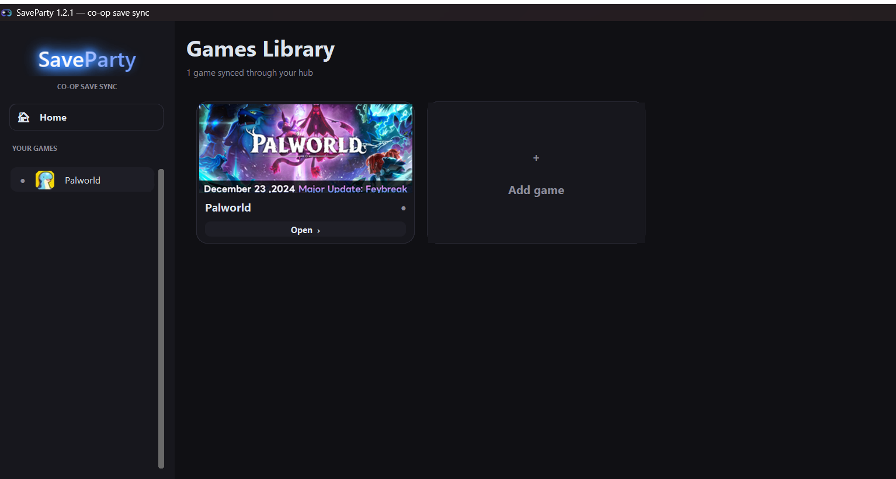

# SaveParty

Share a co-op game save with your friends through a shared cloud folder - any
game with local file saves, no dedicated server, no command line.


SaveParty turns any synced folder (OneDrive, Google Drive, Dropbox, Syncthing -
anything that mirrors a local folder between machines) into a shared world for a
friend group. Whoever wants to play *hosts* the current save: SaveParty pulls the
latest version, locks the folder so nobody plays over you, launches the game, and
pushes your progress back when you're done. Your friends still join your live
session the normal way, with invite codes. SaveParty only handles the part games
never solved on their own - taking turns with one shared save without overwriting
each other.



## Features

- **A proper desktop app, not a terminal.** Dark, game-styled UI with per-game
  banner art, a sidebar with a live status dot for every game, and a dialog for
  every decision that matters.
- **Finds your games automatically.** Reads Steam's registry and library folders
  plus known save locations, so games actually installed on your PC are listed
  first and marked "installed · saves found".
- **Pick a save from a list, not a path box.** Each world/slot shows its name,
  last-played time, file count and size, newest first.
- **Compatibility checks before you commit.** Save folder verified, size sanity,
  Steam Cloud conflict warnings (the number-one cause of external-sync corruption),
  wrong-folder-level detection, and per-game notes on characters and co-op.
- **24 built-in game presets** - Palworld, Valheim, Stardew Valley, Terraria,
  Minecraft (Java), Satisfactory, Factorio, Baldur's Gate 3, Elden Ring, Sons of
  the Forest, The Forest, Core Keeper, V Rising, Project Zomboid, 7 Days to Die,
  Raft, Green Hell, Grounded, Enshrouded, Don't Starve Together, Lethal Company,
  Astroneer, RimWorld, Vintage Story - plus a Custom option for anything else with
  local file saves.
- **Palworld host-character fix.** Palworld forces every host into one fixed
  character. SaveParty re-maps the save before each session so whoever hosts plays
  their own character. Each player claims theirs once.
- **Auto-updates through the same folder.** Drop a new build into the shared
  folder and every friend's app offers it on the next launch, verifies the
  download, replaces itself and reopens. No reinstalling, no re-sending files.

## Safety model

This is the part that took the most work, because losing a save is unforgivable.

- **One host at a time.** An advisory lock with heartbeats shows exactly who is
  playing; a stale lock (crashed session) can be taken over safely.
- **Ordering by generation, never by clock.** "Who has the newest save" is decided
  by a monotonic generation counter and a push token, so it is immune to clock
  differences between machines.
- **Torn uploads are detected.** The manifest is written last and carries a SHA-256
  for every file, so a folder your cloud client is still syncing is recognised and
  never imported half-finished.
- **Nothing is overwritten silently.** Pulls stage into a temp folder, verify every
  checksum, then swap with rollback. Every overwrite is preceded by a zipped
  backup, and a real conflict always asks you.
- **Upload confirmation.** After you push, SaveParty waits until your sync client
  has actually delivered the save to the others - with a live progress read-out -
  before it calls the session done. Closing the PC right after playing can't strand
  your progress locally.

## Install

Requires **Windows** and **Python 3.10+**, or just the built `SaveParty.exe`
(friends need nothing else installed).

```powershell
git clone https://github.com/root6969/SaveParty
cd SaveParty
pip install -r requirements.txt
python SaveParty.py
```

## Quick start

1. Everyone installs a sync client (OneDrive / Google Drive / Dropbox / Syncthing)
   and shares **one folder** that each person mirrors locally.
2. **First player:** *Add game* → pick the game → pick the save from the browser →
   read the compatibility checklist → accept the suggested shared subfolder →
   create the profile → *Sync now* seeds the folder.
3. **Everyone else:** the same *Add game*, pointing at the same shared folder.
   SaveParty pulls the shared save down.
4. Day to day: open SaveParty and press **Play**. It locks, pulls, launches,
   watches for the game to close, pushes and unlocks. If a friend is already
   playing, you'll see exactly who.

Three rules keep it clean: one host at a time (the lock enforces it), let your sync
client finish uploading after you play (the app waits for it), and disable Steam
Cloud for synced games when the checker tells you to.

## How it works

Every sync decision is a three-way compare. A local state file remembers the
manifest generation and file snapshot from the last successful sync on this
machine. If only the local save changed since then, it pushes; if only the shared
folder moved, it pulls; if both changed, it opens a conflict dialog and zips the
losing side first.

The shared folder holds `saves/`, a `manifest.json` written last with a hash per
file, and `saveparty.lock` that carries heartbeats while someone plays. Backups
live in `%LocalAppData%\SaveParty\_backups`, pruned per kind, with conflict exports
kept indefinitely.

The Palworld module parses only the structures it needs (the character map and the
guild map) and keeps everything else as opaque bytes. It refuses to touch a save
unless it can first reproduce it byte-for-byte, so a game update degrades to
"character features unavailable" rather than a corrupted world. The save-editing
technique follows xNul's `palworld-host-save-fix` and NFZ-441's fork, both MIT.

## Building the exe

```powershell
pip install pyinstaller
pyinstaller SaveParty.spec --noconfirm
```

`dist\SaveParty.exe` is fully self-contained, with the app icon and Windows file
metadata baked in. The icon itself is generated in code by `saveparty/ui/art.py`,
which draws all of the app's artwork procedurally - there are no binary art assets
in the repository. SmartScreen warns on unsigned executables; choose "More info →
Run anyway".

Publishing an update to your group:

```powershell
python SaveParty.py --publish-update --version 1.3.0 --exe dist\SaveParty.exe --notes "what changed"
```

That copies the build into the shared folder's `updates/` folder and writes a
descriptor. Everyone's sync client mirrors it, and their next launch offers the
update.

## Tests

```powershell
python tests/core_e2e.py
```

Two simulated players exercise the full sync core in a sandbox: seed, join,
push/pull, excluded-folder preservation, conflict resolve and defer, lock blocking,
restore, torn-upload detection and a full play session. No games or cloud accounts
needed; it runs in under a minute.

## Limitations

- The lock is advisory. Cloud propagation takes seconds to minutes, so two people
  pressing Play at the same instant can still race. The group rule stays "one at a
  time" - SaveParty makes it visible and recoverable, not physically impossible.
- Games that keep saves server-side or tie them to accounts can't pass a save
  cleanly; the compatibility checker flags the common cases.
- Character handling differs per game. The checker's notes tell you each game's
  reality (for example, the Valheim and Terraria presets sync worlds only, so
  personal characters are never overwritten).
- Windows only for now.

## Built with

[CustomTkinter](https://github.com/TomSchimansky/CustomTkinter) ·
[Pillow](https://python-pillow.org/) ·
[psutil](https://github.com/giampaolo/psutil) ·
[watchdog](https://github.com/gorakhargosh/watchdog) ·
[palworld-save-tools](https://github.com/cheahjs/palworld-save-tools) ·
[PyInstaller](https://pyinstaller.org/)

## License

MIT - see [LICENSE](LICENSE).
